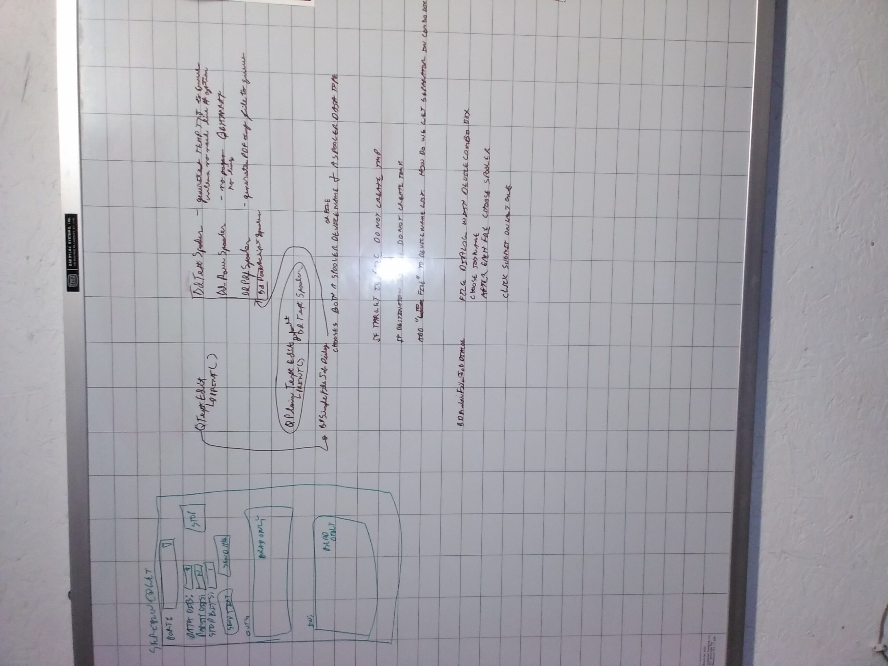

# LsCs/BasisDoctrina Print Logic Design

Legacy printing such as CopperSpice and Qt have was developed in the 1980s, continued into the 1990s, and very few people bothered to change it. Back then we had dot-matrix printers connected by a serial or parallel cable on a single core 286 or worse computer. Even GUI-DOS, a.k.a. Windows, was doing battle with the infamous 640K memory barrier. We didn't have enough machine to reliably do two meaningful things at once.

## Legacy printing
- opens a device via its port, today it can also be network address
- locks the device for its own use
- dumps an ASCII/raw file that relies on the printer to paginate it, or generates a single page at a time in Postscript, PDF, PCL3 or printer specific format
- after tying up this port to send generate and send pages one at a time, closes port.

Printers and file servers have had to accommodate this antiquated technology for a very long time. It doesn't work in the world of networked printers that can do so much more than print. It definitely does not work in the world of 3D printing when you are trying to concrete print a house.

## Cups 3.x World

Cups 3.x recognizes legacy cannot work anymore. Wireless and even wired network printers have their own built-in print servers. We are getting closer and closer to driverless printing actually working. Before you say it actually works, try duplex printing. 

Today printers want the entire print job sent as one big chunk. That's right, _print job_. One to N files all joined together. This is how you 3D print a house using a concrete printer and 3D print many other things. It's also how you complete corporate reports complete with cover and binding. Lot us not forget printing books on demand via something like an Espresso book machine.

Image above was lifted from BasisDoctrina whiteboarding. 

### Core of Design
We are going to lift the original design work for BasisDoctrina, change the names, and flesh it out. At the core of this design are the spoolers. Note: If the destination is a file instead of a device, no temp file will be created by the spoolers.

**lscs_spooler_text**  Generates a UTF-8 text temporary file to handle situations like wanting line numbers or only printing a selected range of text from a text editor/field.

**lscs_spooler_raw** No pages, no line numbers. Generates temporary binary file using the bytes passed as-is. Think printing an image, sending robotic instructions to industrial or 3D equipment. Things that need zero interpretation. 

**lscs_spooler_postscript** Generates a temporary Postscript file. Supports line numbers, again, think text editor. Document could be complete with images, text, etc. 

**lscs_spooler_pdf**  Same as Postscript, but PDF this time.

**lscs_spooler_ODT**  Creates ODT temporary file to help support word processor creators.

**lscs_spooler_msword**  Creates doc, possibly docx, temporary file to support word processor creators.

### lscs_single_file_job_dialog
Meant to be called from text editor, word processor, multi-file dialog, etc. Receives byte array containing either the raw content or full path to an input file. User chooses an output device name or file along with a spooler type.

Say your network has a printer named My_Brother_Printer. You could choose that and the PDF spooler to create a PDF file that will be sent directly to the print queue.

Basically this is what an end user sees now, but it doesn't lock the device generating a page at a time. The spooler generates whatever pagination, if any, needed, completes the entire file, then submits it to the print queue. People coming from Mainframe and midrange computing environments are already used to this. It is how we've printed since the 1960s. PCs finally caught up.

### lscs_multi_file_job_dialog
Allows user to enter a job name and select a destination device or file name. 

Next the user has a file dialog where they can navigate their system choosing files to include in the job. Each file gets a spooler type assigned to it. The order of the file selections is their order within the job. 

When the user is done they click the submit button. Spoolers chew through the files creating temporary files that get submitted as one big job to the output device or file. 

